| algorithm | sample1 | sample_size | output | output_image_size | duration | seed | algorithm_parameters |
|:----:|:----:|:----:|:----:|:----:|:----:|:----:|:----:|
|COC||16x16||64x64|77|42|Temperature=1, Receptor=2, Iterations=2|
|COC||16x16||64x64|75|42|Temperature=0.1, Receptor=2, Iterations=2|
|COC||16x16||64x64|143|42|Temperature=0.1, Receptor=2, Iterations=4|
|COC||32x16||128x128|282|42|Temperature=1, Receptor=2, Iterations=2|
|COC||32x16||128x128|1371|42|Temperature=1, Receptor=3, Iterations=2|
|COC||32x16||128x128|4155|42|Temperature=1, Receptor=4, Iterations=2|
|COC||32x16||128x128|8122|42|Temperature=1, Receptor=4, Iterations=4|
|COC||16x16||128x128|280|42|Temperature=1, Receptor=2, Iterations=2|
|COC||16x16||128x128|554|42|Temperature=1, Receptor=2, Iterations=4|
|COC||16x16||128x128|1095|42|Temperature=1, Receptor=2, Iterations=8|
|COC||16x16||32x128|74|42|Temperature=1, Receptor=2, Iterations=2|
|COC||16x16||32x128|141|42|Temperature=1, Receptor=2, Iterations=4|
|COC||16x16||32x128|74|42|Temperature=0.1, Receptor=2, Iterations=2|
|COC||4x4||64x64|74|42|Temperature=1, Receptor=2, Iterations=2|
|COC||4x4||64x64|108|42|Temperature=1, Receptor=2, Iterations=3|
|COC||4x4||64x64|141|42|Temperature=0.1, Receptor=2, Iterations=4|
|COC||16x16||64x64|845|-1(592)|Temperature=0.5, Receptor=3, Iterations=5|
|COC||4x4|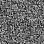|64x64|347|-1(490)|Temperature=1, Receptor=2, Iterations=10|
|COC||16x16||64x64|1638|-1(889)|Temperature=1, Receptor=3, Iterations=10|
|COC||16x16||64x64|1660|-1(588)|Temperature=1, Receptor=3, Iterations=10|
|COC||16x16||64x64|41|-1(310)|Temperature=1, Receptor=2, Iterations=1|
|COC||16x16|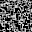|64x64|1662|-1(405)|Temperature=1, Receptor=3, Iterations=10|
|COC|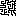|16x16|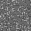|64x64|1671|-1(131)|Temperature=1, Receptor=3, Iterations=10|
|COC||16x16|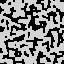|64x64|1653|-1(856)|Temperature=1, Receptor=3, Iterations=10|
|COC||16x16||64x64|1658|-1(570)|Temperature=1, Receptor=3, Iterations=10|
|COC||11x11||64x64|1654|-1(286)|Temperature=1, Receptor=3, Iterations=10|
|COC||15x15||64x64|1658|-1(994)|Temperature=1, Receptor=3, Iterations=10|
|COC||32x16|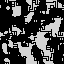|64x64|1672|-1(713)|Temperature=1, Receptor=3, Iterations=10|
|COC||16x16|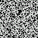|64x64|878|-1(809)|Temperature=0.5, Receptor=3, Iterations=5|
|COC||4x4|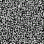|64x64|399|-1(734)|Temperature=1, Receptor=2, Iterations=10|
|COC||16x16||64x64|1695|-1(178)|Temperature=1, Receptor=3, Iterations=10|
|COC||16x16|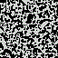|64x64|1713|-1(924)|Temperature=1, Receptor=3, Iterations=10|
|COC||16x16||64x64|205|-1(692)|Temperature=1, Receptor=2, Iterations=5|
|COC||16x16||64x64|1713|-1(952)|Temperature=1, Receptor=3, Iterations=10|
|COC||16x16||64x64|1723|-1(717)|Temperature=1, Receptor=3, Iterations=10|
|COC||16x16|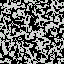|64x64|1710|-1(495)|Temperature=1, Receptor=3, Iterations=10|
|COC||16x16||64x64|1711|-1(256)|Temperature=1, Receptor=3, Iterations=10|
|COC||11x11|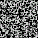|64x64|1712|-1(25)|Temperature=1, Receptor=3, Iterations=10|
|COC||15x15||64x64|1711|-1(790)|Temperature=1, Receptor=3, Iterations=10|
|COC||32x16|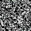|64x64|1707|-1(552)|Temperature=1, Receptor=3, Iterations=10|
