| algorithm | sample1 | sample_size | output | output_image_size | duration | seed | algorithm_parameters |
|:----:|:----:|:----:|:----:|:----:|:----:|:----:|:----:|
|COH||13x13|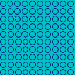|128x128|1844|42|neighborhood=3, K=1|
|COH||13x13|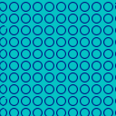|128x128|2192|42|neighborhood=4, K=1|
|COH||13x13|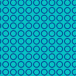|128x128|2114|42|neighborhood=5, K=1|
|COH||25x25|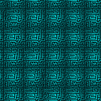|128x128|2062|42|neighborhood=1, K=1|
|COH||25x25|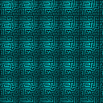|128x128|2149|42|neighborhood=2, K=1|
|COH||25x25|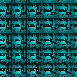|128x128|2137|42|neighborhood=3, K=1|
|COH||32x32||128x32|514|42|neighborhood=3, K=1|
|COH||32x32||128x32|474|42|neighborhood=4, K=1|
|COH||32x32||128x32|503|42|neighborhood=5, K=1|
|COH||32x32||128x32|551|42|neighborhood=3, K=1|
|COH||32x32||128x32|528|42|neighborhood=4, K=1|
|COH||32x32||128x32|502|42|neighborhood=5, K=1|
|COH||32x32|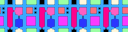|128x32|495|42|neighborhood=3, K=1|
|COH||32x32||128x32|466|42|neighborhood=4, K=1|
|COH||32x32||128x32|514|42|neighborhood=5, K=1|
|COH||50x25|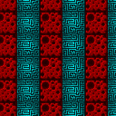|128x128|2110|42|neighborhood=1, K=1|
|COH||50x25|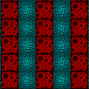|128x128|2133|42|neighborhood=2, K=1|
|COH||50x25|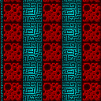|128x128|2123|42|neighborhood=3, K=1|
|COH||25x50|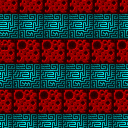|128x128|2146|42|neighborhood=1, K=1|
|COH||25x50|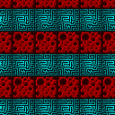|128x128|2154|42|neighborhood=2, K=1|
|COH||25x50|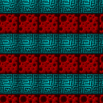|128x128|2118|42|neighborhood=3, K=1|
|COH||32x32|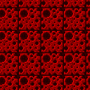|128x128|2118|42|neighborhood=1, K=1|
|COH||32x32|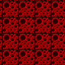|128x128|2146|42|neighborhood=2, K=1|
|COH||32x32|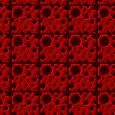|128x128|2088|42|neighborhood=3, K=1|
|COH||32x32|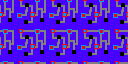|128x64|1086|42|neighborhood=1, K=1|
|COH||32x32|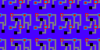|128x64|1014|42|neighborhood=2, K=1|
|COH||32x32|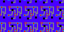|128x64|1045|42|neighborhood=3, K=1|
|COH||32x32|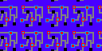|128x64|1071|42|neighborhood=4, K=1|
|COH||32x32|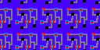|128x64|1061|42|neighborhood=5, K=1|
|COH||32x32|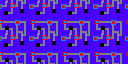|128x64|1076|42|neighborhood=6, K=1|
|COH||25x25|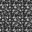|64x64|465|42|neighborhood=1, K=1|
|COH||25x25|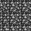|64x64|546|42|neighborhood=2, K=1|
|COH||25x25|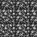|64x64|511|42|neighborhood=3, K=1|
|COH||13x13||128x128|2045|42|neighborhood=3, K=1|
|COH||13x13|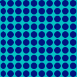|128x128|2121|42|neighborhood=4, K=1|
|COH||13x13|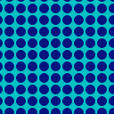|128x128|2109|42|neighborhood=5, K=1|
|COH||64x32|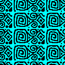|128x128|2125|42|neighborhood=1, K=1|
|COH||64x32|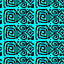|128x128|2173|42|neighborhood=2, K=1|
|COH||64x32|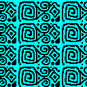|128x128|2057|42|neighborhood=3, K=1|
|COH||32x32|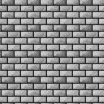|128x128|2092|42|neighborhood=1, K=1|
|COH||32x32|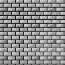|128x128|2124|42|neighborhood=2, K=1|
|COH||32x32|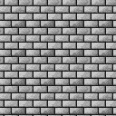|128x128|2105|42|neighborhood=3, K=1|
