| algorithm | sample1 | sample_size | output | output_image_size | duration | seed | algorithm_parameters |
|:----:|:----:|:----:|:----:|:----:|:----:|:----:|:----:|
|COH||25x25|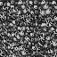|64x64|179|42|neighborhood=1, K=2|
|COH||25x25|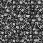|64x64|143|42|neighborhood=2, K=2|
|COH||25x25|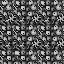|64x64|158|42|neighborhood=3, K=2|
|COH||32x32|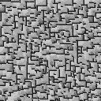|128x128|583|42|neighborhood=1, K=2|
|COH||32x32|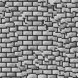|128x128|549|42|neighborhood=2, K=2|
|COH||32x32|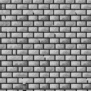|128x128|579|42|neighborhood=3, K=2|
|COH||64x32|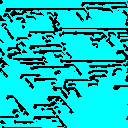|128x128|535|42|neighborhood=1, K=2|
|COH||64x32|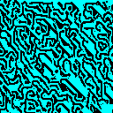|128x128|601|42|neighborhood=2, K=2|
|COH||64x32||128x128|564|42|neighborhood=3, K=2|
|COH||50x25|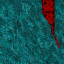|128x128|523|33|neighborhood=1, K=2|
|COH||50x25|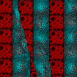|128x128|567|33|neighborhood=2, K=2|
|COH||50x25|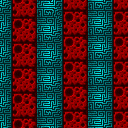|128x128|591|33|neighborhood=3, K=2|
|COH||25x50|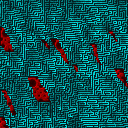|128x128|536|33|neighborhood=1, K=2|
|COH||25x50|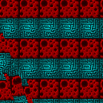|128x128|553|33|neighborhood=2, K=2|
|COH||25x50|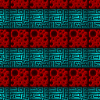|128x128|556|33|neighborhood=3, K=2|
|COH||32x32|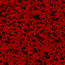|128x128|584|42|neighborhood=1, K=2|
|COH||32x32|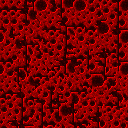|128x128|581|42|neighborhood=2, K=2|
|COH||32x32|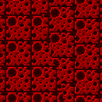|128x128|564|42|neighborhood=3, K=2|
|COH||25x25|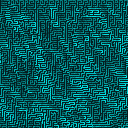|128x128|565|42|neighborhood=1, K=2|
|COH||25x25|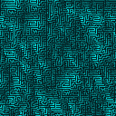|128x128|579|42|neighborhood=2, K=2|
|COH||25x25|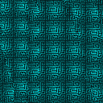|128x128|610|42|neighborhood=3, K=2|
|COH|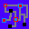|32x32|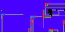|128x64|265|-1(861)|neighborhood=1, K=2|
|COH||32x32|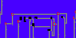|128x64|269|-1(344)|neighborhood=2, K=2|
|COH||32x32|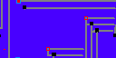|128x64|276|-1(942)|neighborhood=3, K=2|
|COH||32x32|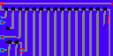|128x64|331|-1(649)|neighborhood=4, K=2|
|COH||32x32|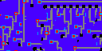|128x64|345|-1(606)|neighborhood=5, K=2|
|COH||32x32|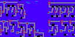|128x64|371|-1(767)|neighborhood=6, K=2|
|COH||13x13||128x128|574|-1(237)|neighborhood=3, K=2|
|COH||13x13|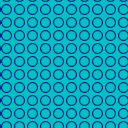|128x128|616|-1(911)|neighborhood=4, K=2|
|COH||13x13||128x128|648|-1(633)|neighborhood=5, K=2|
|COH||13x13||128x128|596|-1(386)|neighborhood=3, K=2|
|COH||13x13|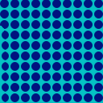|128x128|634|-1(76)|neighborhood=4, K=2|
|COH||13x13||128x128|688|-1(813)|neighborhood=5, K=2|
|COH||32x32||128x32|142|4242|neighborhood=3, K=2|
|COH||32x32||128x32|151|4242|neighborhood=4, K=2|
|COH||32x32||128x32|196|4242|neighborhood=5, K=2|
|COH||32x32||128x32|186|4242|neighborhood=3, K=2|
|COH||32x32||128x32|176|4242|neighborhood=4, K=2|
|COH||32x32||128x32|158|4242|neighborhood=5, K=2|
|COH||32x32||128x32|141|4242|neighborhood=3, K=2|
|COH||32x32|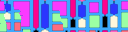|128x32|151|4242|neighborhood=4, K=2|
|COH||32x32||128x32|154|4242|neighborhood=5, K=2|
