| algorithm | sample1 | sample_size | output | output_image_size | duration | seed | algorithm_parameters |
|:----:|:----:|:----:|:----:|:----:|:----:|:----:|:----:|
|COH||25x25|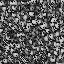|64x64|170|42|neighborhood=1, K=3|
|COH||25x25|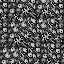|64x64|142|42|neighborhood=2, K=3|
|COH||25x25|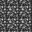|64x64|147|42|neighborhood=3, K=3|
|COH||32x32|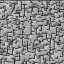|128x128|567|42|neighborhood=1, K=3|
|COH||32x32|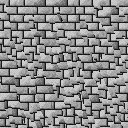|128x128|572|42|neighborhood=2, K=3|
|COH||32x32|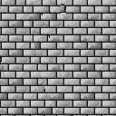|128x128|596|42|neighborhood=3, K=3|
|COH||64x32|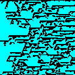|128x128|534|42|neighborhood=1, K=3|
|COH||64x32|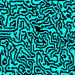|128x128|601|42|neighborhood=2, K=3|
|COH||64x32|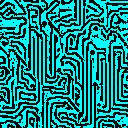|128x128|583|42|neighborhood=3, K=3|
|COH||50x25|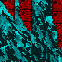|128x128|541|33|neighborhood=1, K=3|
|COH||50x25|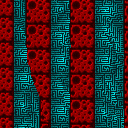|128x128|589|33|neighborhood=2, K=3|
|COH||50x25|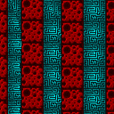|128x128|628|33|neighborhood=3, K=3|
|COH||25x50|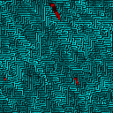|128x128|586|33|neighborhood=1, K=3|
|COH||25x50|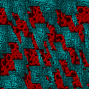|128x128|554|33|neighborhood=2, K=3|
|COH||25x50|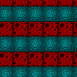|128x128|599|33|neighborhood=3, K=3|
|COH||32x32|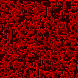|128x128|569|42|neighborhood=1, K=3|
|COH||32x32|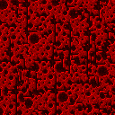|128x128|597|42|neighborhood=2, K=3|
|COH||32x32|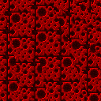|128x128|638|42|neighborhood=3, K=3|
|COH||25x25|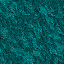|128x128|549|42|neighborhood=1, K=3|
|COH||25x25|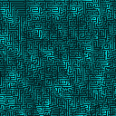|128x128|613|42|neighborhood=2, K=3|
|COH||25x25||128x128|649|42|neighborhood=3, K=3|
|COH||32x32|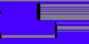|128x64|264|-1(536)|neighborhood=1, K=3|
|COH||32x32|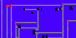|128x64|307|-1(22)|neighborhood=2, K=3|
|COH||32x32|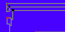|128x64|284|-1(655)|neighborhood=3, K=3|
|COH||32x32|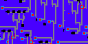|128x64|323|-1(402)|neighborhood=4, K=3|
|COH||32x32|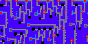|128x64|343|-1(360)|neighborhood=5, K=3|
|COH||32x32|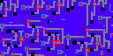|128x64|372|-1(522)|neighborhood=6, K=3|
|COH||13x13|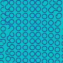|128x128|646|-1(992)|neighborhood=3, K=3|
|COH||13x13|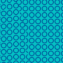|128x128|692|-1(744)|neighborhood=4, K=3|
|COH||13x13|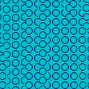|128x128|691|-1(545)|neighborhood=5, K=3|
|COH||13x13|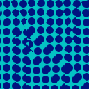|128x128|635|-1(345)|neighborhood=3, K=3|
|COH||13x13||128x128|654|-1(81)|neighborhood=4, K=3|
|COH||13x13||128x128|672|-1(834)|neighborhood=5, K=3|
|COH||32x32||128x32|149|4242|neighborhood=3, K=3|
|COH||32x32||128x32|195|4242|neighborhood=4, K=3|
|COH||32x32||128x32|168|4242|neighborhood=5, K=3|
|COH||32x32||128x32|150|4242|neighborhood=3, K=3|
|COH||32x32||128x32|158|4242|neighborhood=4, K=3|
|COH||32x32||128x32|170|4242|neighborhood=5, K=3|
|COH||32x32||128x32|145|4242|neighborhood=3, K=3|
|COH||32x32||128x32|156|4242|neighborhood=4, K=3|
|COH||32x32||128x32|216|4242|neighborhood=5, K=3|
