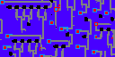

| algorithm | sample1 | sample_size | output | output_image_size | duration | seed | algorithm_parameters |
|:----:|:----:|:----:|:----:|:----:|:----:|:----:|:----:|
|COH||13x13||128x128|1928|42|neighborhood=3, K=3|
|COH||13x13||128x128|1376|42|neighborhood=4, K=3|
|COH||13x13||128x128|1262|42|neighborhood=5, K=3|
|COH||25x25||128x128|1167|42|neighborhood=1, K=3|
|COH||25x25||128x128|1259|42|neighborhood=2, K=3|
|COH||25x25||128x128|1334|42|neighborhood=3, K=3|
|COH||32x32||128x32|331|42|neighborhood=3, K=3|
|COH||32x32||128x32|341|42|neighborhood=4, K=3|
|COH||32x32||128x32|329|42|neighborhood=5, K=3|
|COH||32x32||128x32|318|42|neighborhood=3, K=3|
|COH||32x32||128x32|313|42|neighborhood=4, K=3|
|COH||32x32||128x32|358|42|neighborhood=5, K=3|
|COH||32x32||128x32|341|42|neighborhood=3, K=3|
|COH||32x32||128x32|344|42|neighborhood=4, K=3|
|COH||32x32||128x32|539|42|neighborhood=5, K=3|
|COH||50x25||128x128|2093|42|neighborhood=1, K=3|
|COH||50x25||128x128|2100|42|neighborhood=2, K=3|
|COH||50x25||128x128|2155|42|neighborhood=3, K=3|
|COH||25x50||128x128|2097|42|neighborhood=1, K=3|
|COH||25x50||128x128|2095|42|neighborhood=2, K=3|
|COH||25x50||128x128|2182|42|neighborhood=3, K=3|
|COH||32x32||128x128|2041|42|neighborhood=1, K=3|
|COH||32x32||128x128|2108|42|neighborhood=2, K=3|
|COH||32x32||128x128|2193|42|neighborhood=3, K=3|
|COH||32x32||128x64|1034|42|neighborhood=1, K=3|
|COH||32x32||128x64|1021|42|neighborhood=2, K=3|
|COH||32x32||128x64|1079|42|neighborhood=3, K=3|
|COH||32x32||128x64|1068|42|neighborhood=4, K=3|
|COH||32x32||128x64|1093|42|neighborhood=5, K=3|
|COH||32x32||128x64|1071|42|neighborhood=6, K=3|
|COH||25x25||64x64|547|42|neighborhood=1, K=3|
|COH||25x25||64x64|458|42|neighborhood=2, K=3|
|COH||25x25||64x64|530|42|neighborhood=3, K=3|
|COH||13x13||128x128|2171|42|neighborhood=3, K=3|
|COH||13x13||128x128|2223|42|neighborhood=4, K=3|
|COH||13x13||128x128|2223|42|neighborhood=5, K=3|
|COH||64x32||128x128|2113|42|neighborhood=1, K=3|
|COH||64x32||128x128|2098|42|neighborhood=2, K=3|
|COH||64x32||128x128|2005|42|neighborhood=3, K=3|
|COH||32x32||128x128|2053|42|neighborhood=1, K=3|
|COH||32x32||128x128|2161|42|neighborhood=2, K=3|
|COH||32x32||128x128|2072|42|neighborhood=3, K=3|
