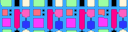

| algorithm | sample1 | sample_size | output | output_image_size | duration | seed | algorithm_parameters |
|:----:|:----:|:----:|:----:|:----:|:----:|:----:|:----:|
|COH||13x13||128x128|2229|42|neighborhood=3, K=4|
|COH||13x13||128x128|2302|42|neighborhood=4, K=4|
|COH||13x13||128x128|2364|42|neighborhood=5, K=4|
|COH||25x25||128x128|2084|42|neighborhood=1, K=4|
|COH||25x25||128x128|2044|42|neighborhood=2, K=4|
|COH||25x25||128x128|2244|42|neighborhood=3, K=4|
|COH||32x32||128x32|551|42|neighborhood=3, K=4|
|COH||32x32||128x32|546|42|neighborhood=4, K=4|
|COH||32x32||128x32|509|42|neighborhood=5, K=4|
|COH||32x32||128x32|533|42|neighborhood=3, K=4|
|COH||32x32||128x32|543|42|neighborhood=4, K=4|
|COH||32x32||128x32|536|42|neighborhood=5, K=4|
|COH||32x32||128x32|449|42|neighborhood=3, K=4|
|COH||32x32||128x32|511|42|neighborhood=4, K=4|
|COH||32x32||128x32|566|42|neighborhood=5, K=4|
|COH||50x25||128x128|2163|42|neighborhood=1, K=4|
|COH||50x25||128x128|2167|42|neighborhood=2, K=4|
|COH||50x25||128x128|2216|42|neighborhood=3, K=4|
|COH||25x50||128x128|2203|42|neighborhood=1, K=4|
|COH||25x50||128x128|2130|42|neighborhood=2, K=4|
|COH||25x50||128x128|2234|42|neighborhood=3, K=4|
|COH||32x32||128x128|2131|42|neighborhood=1, K=4|
|COH||32x32||128x128|1974|42|neighborhood=2, K=4|
|COH||32x32||128x128|1335|42|neighborhood=3, K=4|
|COH||32x32||128x64|630|42|neighborhood=1, K=4|
|COH||32x32||128x64|679|42|neighborhood=2, K=4|
|COH||32x32||128x64|1104|42|neighborhood=3, K=4|
|COH||32x32||128x64|1111|42|neighborhood=4, K=4|
|COH||32x32||128x64|1134|42|neighborhood=5, K=4|
|COH||32x32||128x64|1173|42|neighborhood=6, K=4|
|COH||25x25||64x64|558|42|neighborhood=1, K=4|
|COH||25x25||64x64|561|42|neighborhood=2, K=4|
|COH||25x25||64x64|496|42|neighborhood=3, K=4|
|COH||13x13||128x128|2190|42|neighborhood=3, K=4|
|COH||13x13||128x128|2216|42|neighborhood=4, K=4|
|COH||13x13||128x128|2288|42|neighborhood=5, K=4|
|COH||64x32||128x128|2134|42|neighborhood=1, K=4|
|COH||64x32||128x128|2168|42|neighborhood=2, K=4|
|COH||64x32||128x128|2208|42|neighborhood=3, K=4|
|COH||32x32||128x128|2166|42|neighborhood=1, K=4|
|COH||32x32||128x128|2184|42|neighborhood=2, K=4|
|COH||32x32||128x128|2209|42|neighborhood=3, K=4|
