| algorithm | sample1 | sample_size | output | output_image_size | duration | seed | algorithm_parameters |
|:----:|:----:|:----:|:----:|:----:|:----:|:----:|:----:|
|FNS||25x25|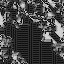|64x64|1208|42|neighborhood=1|
|FNS||25x25|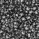|64x64|3116|42|neighborhood=2|
|FNS||25x25|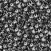|64x64|5464|42|neighborhood=3|
|FNS||32x32|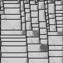|128x128|7010|42|neighborhood=1|
|FNS||32x32|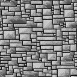|128x128|17794|42|neighborhood=2|
|FNS||32x32|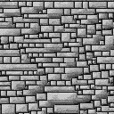|128x128|33994|42|neighborhood=3|
|FNS||64x32|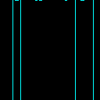|128x128|13665|42|neighborhood=1|
|FNS||64x32|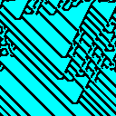|128x128|36287|42|neighborhood=2|
|FNS||64x32|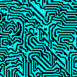|128x128|69791|42|neighborhood=3|
|FNS||50x25|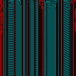|128x128|8384|33|neighborhood=1|
|FNS||50x25|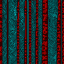|128x128|24138|33|neighborhood=2|
|FNS||50x25|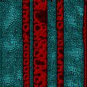|128x128|43619|33|neighborhood=3|
|FNS||25x50|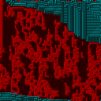|128x128|8844|33|neighborhood=1|
|FNS||25x50|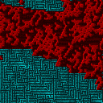|128x128|22991|33|neighborhood=2|
|FNS||25x50||128x128|42463|33|neighborhood=3|
|FNS||32x32|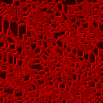|128x128|7016|42|neighborhood=1|
|FNS||32x32|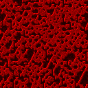|128x128|18782|42|neighborhood=2|
|FNS||32x32|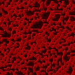|128x128|35113|42|neighborhood=3|
|FNS||25x25|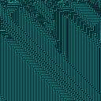|128x128|5052|42|neighborhood=1|
|FNS||25x25|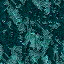|128x128|12302|42|neighborhood=2|
|FNS||25x25|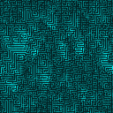|128x128|21109|42|neighborhood=3|
|FNS||32x32|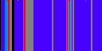|128x64|3385|-1(428)|neighborhood=1|
|FNS||32x32|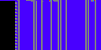|128x64|8622|-1(893)|neighborhood=2|
|FNS||32x32|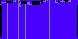|128x64|15881|-1(595)|neighborhood=3|
|FNS||32x32|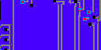|128x64|25722|-1(564)|neighborhood=4|
|FNS||32x32|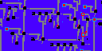|128x64|37690|-1(399)|neighborhood=5|
|FNS||32x32|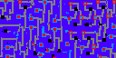|128x64|52188|-1(184)|neighborhood=6|
