| algorithm | sample1 | sample_size | output | output_image_size | duration | seed | algorithm_parameters |
|:----:|:----:|:----:|:----:|:----:|:----:|:----:|:----:|
|HAR|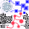|50x50|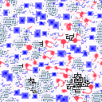|128x128|2146|-1(646)|neighborhood=5, M=20, Polish=5|
|HAR||50x50|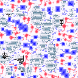|128x128|2144|-1(849)|neighborhood=5, M=20, Polish=5|
|HAR||50x50|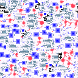|128x128|2137|-1(53)|neighborhood=5, M=20, Polish=5|
|HAR||50x50|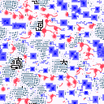|128x128|2134|-1(253)|neighborhood=5, M=20, Polish=5|
|HAR||50x50|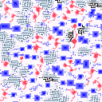|128x128|2139|-1(452)|neighborhood=5, M=20, Polish=5|
|HAR|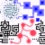|50x50|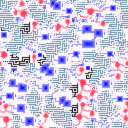|128x128|2813|-1(694)|neighborhood=5, M=20, Polish=5|
|HAR||50x50|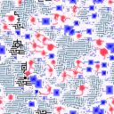|128x128|2842|-1(570)|neighborhood=5, M=20, Polish=5|
|HAR||50x50|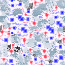|128x128|2816|-1(470)|neighborhood=5, M=20, Polish=5|
|HAR||50x50|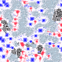|128x128|2829|-1(351)|neighborhood=5, M=20, Polish=5|
|HAR||50x50|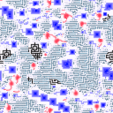|128x128|2795|-1(241)|neighborhood=5, M=20, Polish=5|
|HAR|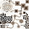|50x50|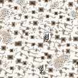|128x128|2220|-1(62)|neighborhood=5, M=20, Polish=5|
|HAR||50x50|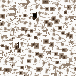|128x128|2307|-1(343)|neighborhood=5, M=20, Polish=5|
|HAR||50x50|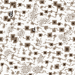|128x128|2222|-1(711)|neighborhood=5, M=20, Polish=5|
|HAR||50x50|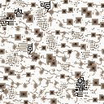|128x128|2176|-1(995)|neighborhood=5, M=20, Polish=5|
|HAR||50x50|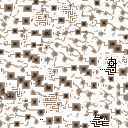|128x128|2135|-1(228)|neighborhood=5, M=20, Polish=5|
|HAR||50x50|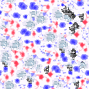|128x128|2123|-1(427)|neighborhood=5, M=20, Polish=5|
|HAR||50x50|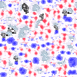|128x128|2133|-1(611)|neighborhood=5, M=20, Polish=5|
|HAR||50x50|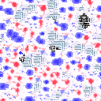|128x128|2129|-1(802)|neighborhood=5, M=20, Polish=5|
|HAR||50x50|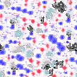|128x128|2122|-1(991)|neighborhood=5, M=20, Polish=5|
|HAR||50x50|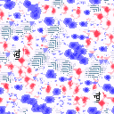|128x128|2132|-1(177)|neighborhood=5, M=20, Polish=5|
