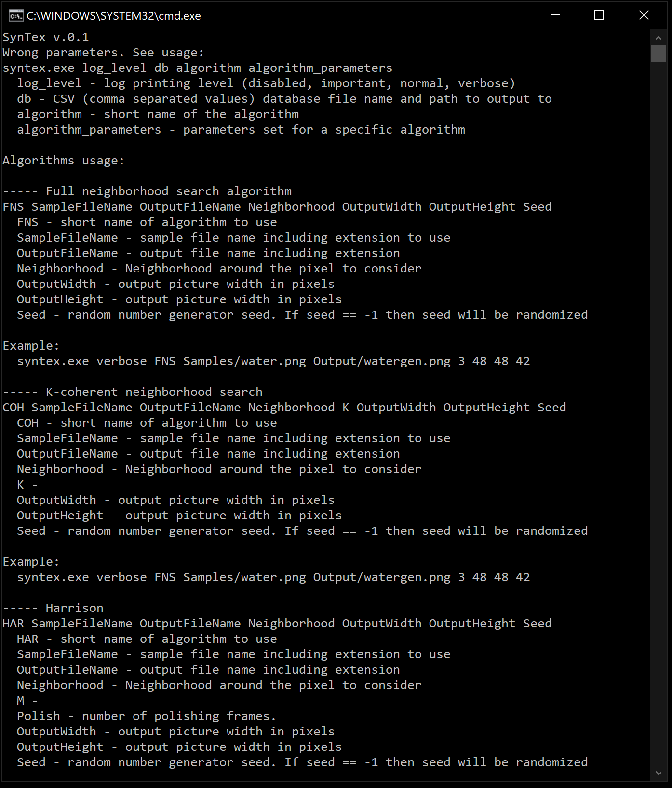
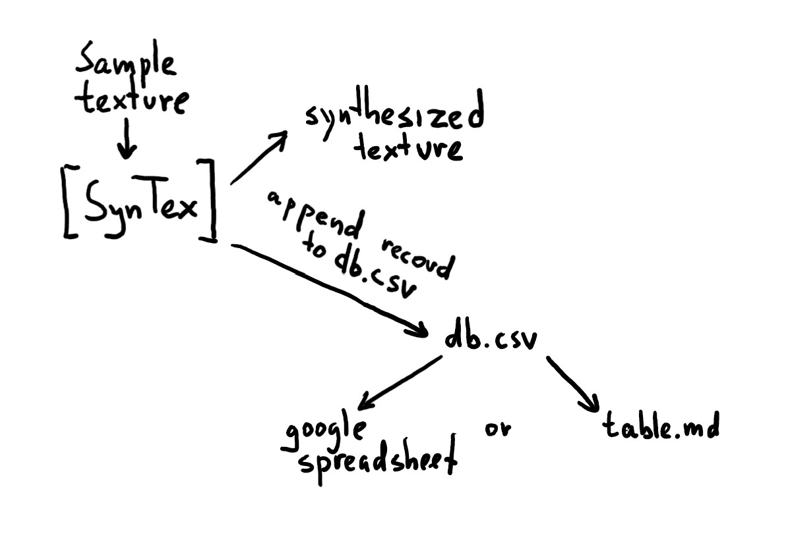

## Intro
The purpose of this project is to create convenient sandbox for different texture synthesis algorithms.  
Algorithms implementations are based on mxgmn repo https://github.com/mxgmn/TextureSynthesis  
Project created for Microsoft Visual Studio 2019 and designed to use on Windows platform. 
Using SynTex you can create spreadsheets like these:  

Full neigbourhood search basic tests: [ExperimentsFNS.md](ExperimentsFNS.md)  
Coherent neighborhood search (K=1) basic tests: [ExperimentsCOH1.md](ExperimentsCOH1.md)  
Coherent neighborhood search (K=2) basic tests: [ExperimentsCOH2.md](ExperimentsCOH2.md)  
Coherent neighborhood search (K=3) basic tests: [ExperimentsCOH3.md](ExperimentsCOH3.md)  
Coherent neighborhood search (K=4) basic tests: [ExperimentsCOH4.md](ExperimentsCOH4.md)  
Resynthesis Harrison's algorithm basic tests: [ExperimentsHAR1.md](ExperimentsHAR1.md)  
Useful for landscape generation: [ExperimentsLandscape.md](ExperimentsLandscape.md)  
Useful for landscape generation: [ExperimentsLandscape2.md](ExperimentsLandscape2.md)  

ConvChain basic tests: [ExperimentsCOC.md](ExperimentsCOC.md)

All synthesis made on Intel(R) Core(TM) i7-6700K CPU @ 4.00GHz (8 CPUs), ~4.0GHz machine. Different computer configuration will provide different duration result (but same visual).
Every table is created by bash scripts located in appropriate experiment directory. To regenerate entire table you have to run all.cmd inside experimet directory.

## Usage
If you run the program without any parameters it will print help.

Also you can find examples of using in the Experiment* directory.  

Every time you run SynTex.exe with proper parameters it generates texture and writes data related to that texture to db.csv. Later you can use db2table.exe tool to generate table from it. Available option at the moment is MD file only.

## Version history
#### Version 0.1
* Refactoring of program structure and code.
* Console application with command line arguments.
* Register new algorithms mechanism added.
* First texture synthesis algorithm full neighborhood search (FNS) added.
* Seed passing support.
* LogChecker added.
* db.csv writing added.

#### Version 0.2
* Outputs are moved according their experiment folder.
* All textures are regenerated on one machine (for comparable duration results)

## If you want to contribute
There are several directions that are nice to support:
* Crossplatform project and build support 
* Generate google spreadsheet as another output from db2table tool
* Generate gif without compression artifacts